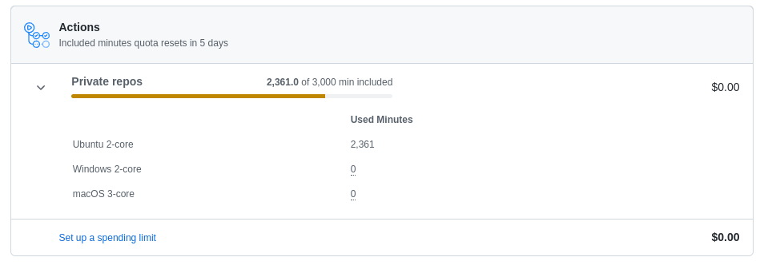
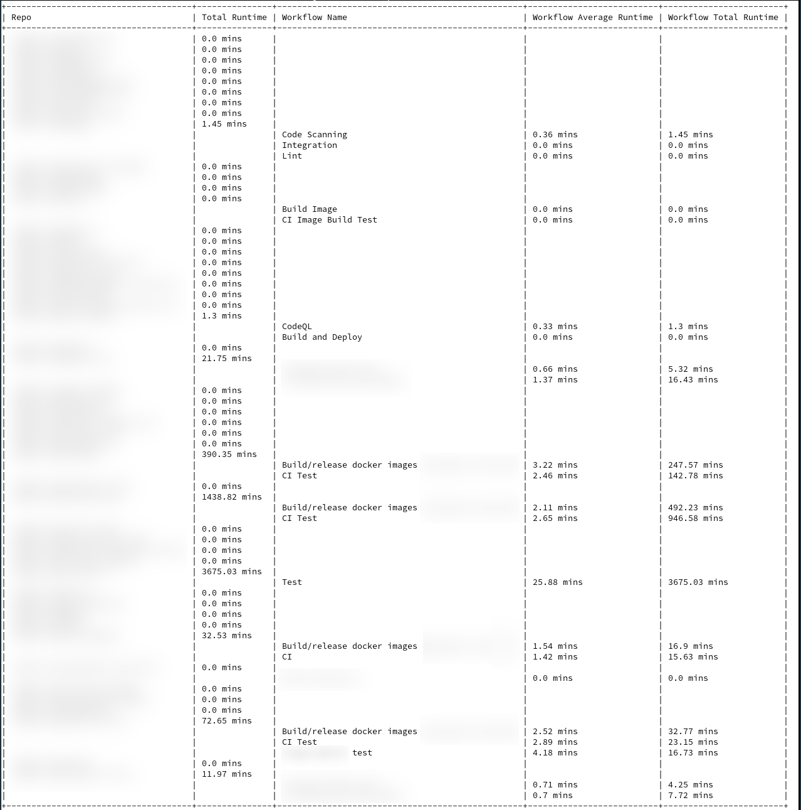

# Actions Stats

Wonder what repo are using your quota? This silly script can quickly give you a view on which repo is using a lot of GitHub Actions minutes.



## Usage

Download and install dependencies:

```
wget https://raw.githubusercontent.com/n0vad3v/actions-stats/master/actions-stats.py
wget https://raw.githubusercontent.com/n0vad3v/actions-stats/master/requirements.txt
pip3 install -r requirements.txt
```

Get last 30 days of usage for org:

```
python3 actions-stats.py '<Org_name>' 'ghp_Txxxxxxxxxxxxxxxxxx2F' 30
```

## Example output



## Public Scanned Orgs

You can take a look at this file: [actions-scan/orgs.md](./actions-scan/orgs.md), reports are generated daily.

If you'd like to add your Org here, please [edit this orgs.yml](https://github.com/n0vad3v/actions-stats-go/edit/master/actions-scan/orgs.yml).